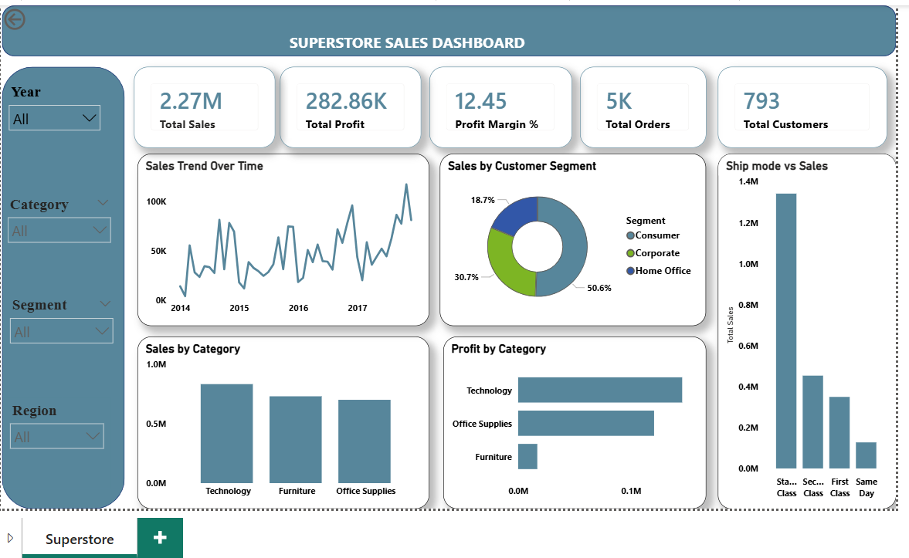

# 📦 Superstore Sales Analysis

[](https://www.mysql.com/)
[](https://powerbi.microsoft.com/)
[](https://www.mysql.com/)
[]()

> *Transforming Superstore retail transaction data into actionable business insights on sales performance, profitability, and customer trends using SQL and Power BI.*

---

## 📌 Project Overview

This project analyses retail sales data from the **Superstore dataset** to understand sales performance, profitability, and customer trends. The analysis was performed using **SQL** for data extraction and querying, and **Power BI** for interactive visualisation.

The goal was to transform raw sales data into meaningful business insights that support strategic decision-making.

---

## 🎯 Objectives

| # | Objective |
|---|-----------|
| 1 | Analyse overall **sales and profit performance** |
| 2 | Identify **high-performing products and categories** |
| 3 | Compare **sales performance by region** |
| 4 | Analyse **sales trends over time** |
| 5 | Identify **loss-making products** |
| 6 | Build an **interactive business dashboard** |

---

## 🗂️ Dataset

| Attribute | Detail |
|-----------|--------|
| **Name** | Superstore Dataset |
| **Source** | [Kaggle](https://www.kaggle.com/) |
| **Domain** | Retail / Business Sales |

**Columns included:**

`Order ID` · `Order Date` · `Ship Date` · `Customer ID` · `Customer Name` · `Segment` · `Region` · `State` · `Category` · `Sub-Category` · `Product Name` · `Sales` · `Profit` · `Quantity`

---

## 🛠️ Tools & Technologies

| Tool | Purpose |
|------|---------|
| 🗄️ MySQL | Data storage and querying |
| 🔍 SQL | Data analysis |
| 📊 Microsoft Power BI | Interactive dashboard & visualisation |

---

## 🔄 Project Workflow

### Step 1 — Data Import
- Superstore dataset imported into a **MySQL database**
- Tables structured and verified for integrity

### Step 2 — Data Cleaning
- Checked and handled missing values
- Removed duplicate records
- Verified and corrected data types
- Standardised column names

### Step 3 — SQL Data Analysis

Eight key business questions answered with SQL:

| # | Query |
|---|-------|
| 1 | Total Sales |
| 2 | Total Profit |
| 3 | Total Orders |
| 4 | Total Customers |
| 5 | Sales by Region |
| 6 | Sales by Category |
| 7 | Top Selling Products |
| 8 | Monthly Sales Trend |

#### Sample SQL Queries

**Total Sales & Profit:**
```sql
SELECT 
    ROUND(SUM(sales), 2) AS total_sales,
    ROUND(SUM(profit), 2) AS total_profit
FROM superstore;
```

**Sales by Region:**
```sql
SELECT 
    region,
    ROUND(SUM(sales), 2) AS total_sales
FROM superstore
GROUP BY region
ORDER BY total_sales DESC;
```

**Top Selling Products:**
```sql
SELECT 
    product_name,
    ROUND(SUM(sales), 2) AS total_sales
FROM superstore
GROUP BY product_name
ORDER BY total_sales DESC
LIMIT 10;
```

**Monthly Sales Trend:**
```sql
SELECT 
    DATE_FORMAT(order_date, '%Y-%m') AS month,
    ROUND(SUM(sales), 2) AS monthly_sales
FROM superstore
GROUP BY month
ORDER BY month;
```

---

## 📈 Power BI Dashboard

An interactive dashboard was built in **Microsoft Power BI** featuring:

- 📌 **KPI Cards** — Sales, Profit, Profit Margin, Orders, Customers
- 📈 Sales Trend Analysis
- 🏷️ Category Performance
- 🗺️ Regional Sales Analysis
- 💰 Profit Analysis
- 🔽 Interactive Filters

### Dashboard Preview


---

## 💡 Key Insights

> **The West region leads in sales, Technology drives profit, but some sub-categories are actively losing money.**

- 🌍 **West region generated the highest sales** across all regions
- 💻 **Technology category produced the highest profit** overall
- 📉 **Some sub-categories generated negative profit** — requiring urgent pricing review
- 📅 **Sales increased toward end of year** — indicating strong seasonal demand in Q4
- 🖊️ **Office Supplies showed consistent sales performance** throughout the year

---

## ✅ Recommendations

1. **Focus on profitable categories** — prioritise Technology and Office Supplies in marketing spend
2. **Optimise regional sales** — boost campaigns in underperforming regions
3. **Review loss-making products** — adjust pricing or discontinue low-profit sub-categories
4. **Plan for seasonal trends** — align inventory and marketing campaigns with Q4 peak months

---

## 🏁 Conclusion

This project demonstrates the ability to transform raw retail data into actionable business insights using **SQL and Power BI**. The interactive dashboard allows stakeholders to explore sales performance and profitability across different dimensions.

The project showcases practical data analyst skills including **SQL querying, data visualisation, and analytical thinking** — all essential for a professional data analyst role.

---

## 📁 Repository Structure

```
superstore-sales-analysis/
│
├── data/
│   └── superstore.csv               # Raw dataset (from Kaggle)
│
├── sql/
│   └── superstore_analysis.sql      # All SQL queries
│
├── dashboard/
│   └── superstore_dashboard.pbix    # Power BI dashboard file
│
├── visuals/
│   ├── dashboard_overview.png
│   ├── sales_by_region.png
│   ├── sales_by_category.png
│   ├── top_products.png
│   └── monthly_trend.png
│
└── README.md
```

---

## 👤 Author

**[Your Name]**
📧 [your.email@example.com](mailto:your.email@example.com)
🔗 [LinkedIn Profile](https://linkedin.com)
🌐 [Portfolio Website](https://yourwebsite.com)

---

*⭐ If you found this project useful, feel free to star the repository!*
